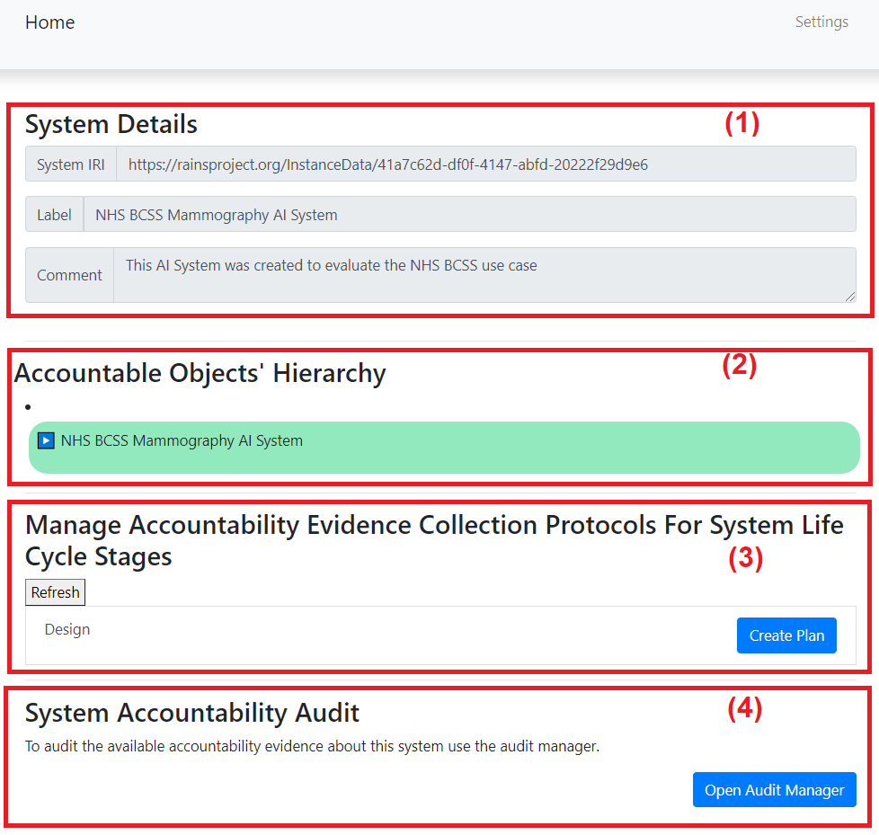
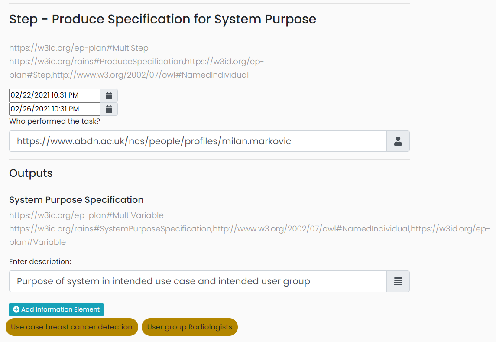
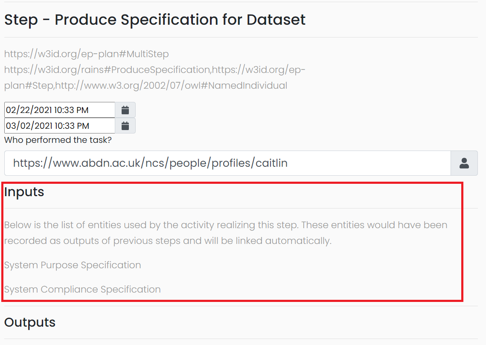
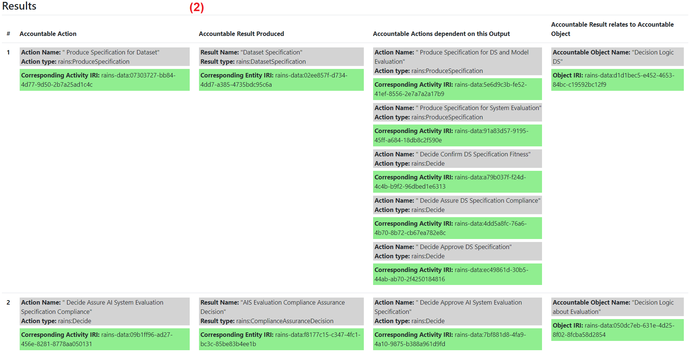

# Example Knowledge Graph
This readme is composed of two sections. The first section describes the scenario we used to create the knowledge graph. The second section consists of documentaion describing how the Accountability Fabric can be used.

## Scenario: 
The knowledge graph was created based on this fictional scenario. A hospital wants to replace one of its two human radiologists with an AI System which can read mammography images and detect bread cancer. This is a fictional scenario, the presented design choices are not the optimal ones, some inferior choices were deliberately made to illustrate that the design stage plays a crucial role in the preventing failures of AI Systems. Some choices were also deliberately not made to show how not following recommended accountability measure may also result in pitfalls down the line. 
#### System-level Specifications 
1.	Produce the system's purpose specification: 
    1. Intended use case: _breast cancer detection, classifying mammography images of women between the ages of fifty and seventy_.
    2. Intended user group: _radiologists_.
2.	Indicate compliance specifications:
    1. hard laws: _complying with the EU's Class IIb Medical Devices Directive and GDPR_;
    2. soft laws: _complying with the following standards: ISO 13485, ISO 14971:2019, and NHS Code of conduct for data-driven health and care technology_.
#### Dataset Specifications
1.	Indicate compliance specifications: 
    1. Hard laws: _complying with GDPR_.
    2. Soft laws: _complying with NHS Code of conduct_. 
2.	Produce a dataset design specification by either designing a dataset or choosing an off-the-shelf one: _Use the 3rd party dataset CBIS-DDSM (https://wiki.cancerimagingarchive.net/display/Public/CBIS-DDSM). This is what is known about this dataset 
    1. Its creator: _R. Lee and the authors of this paper: https://www.nature.com/articles/sdata2017177_.
    2. Its characteristics: _2,620 studies in the form of films (DICOM images) covering malignant, benign, and normal diagnoses. It was originally produced as part of the DDSM_.
    3. Its funding source: _none, but the DDSM was funded by DOD Breast Cancer Research Program and US Army Research and Material Command_.
    4. Its collection method: _collected from four American hospitals with patient consent (Massachusetts General Hospital, Wake Forest University School of Medicine, Sacred Heart Hospital, and Washington University of St Louis School of Medicine)_.
    5. How it was pre-processed: _raw pixel data was converted into 64-bit optical density values, which were in turn re-mapped to 16-bit grey scale TIFF files and finally converted to DICOM format. A noise reduction function was applied to the DICOM format. Images were cropped and a lesion segmentation algorithm was applied. Images were split 80% marked for training and 20% marked for testing with very close percentage of case numbers in each_. 
    6. Its intended use cases: _CAD (Computer-Aided Detection and Diagnosis) research in mammography_. 
    7. Its limitations: _scanned film instead of full field digital mammograms_.
    8. risks: _the DDSM was released in 1997, only 2,620 studies_.
    9. We did not indicate this dataset's bias or its incorrrect use case.
#### Model Specifications
1.	Indicate compliance specifications: 
    1. Hard laws: _complying with the EU's Class IIb Medical Devices Directive_.
    2. Soft laws: _complying with the following standards: ISO 13485, ISO 14971:2019, and NHS Code of conduct_.  
b.	Produce a model design specification by either designing a model or choosing an off-the-shelf one: _design a Deep learning (DL) breast cancer image analysis model, below are the information about the model_:
    1. Its intended use cases: _computer aided breast cancer image analysis_.
    2. Its characteristics of the model: _algorithm: Convolutional Neural_, model characteristics: _Network (CNN) minimum 7 layers, the model should classify images as: normal, benign mass, benign microcalcification, malignant mass, malignant microcalcification. Implementation plans:  programming language: Python and development environment Anaconda_
    3. Its limitations: _it is not possible to perform feature selection or to fine-tune hyperparameters_ 
    4. Its risks: _DL NN perform better with larger amounts of images than they do on smaller amounts (overfitting problem which can be mitigated by applying augmentation techniques)_
    5. We did not indicate this model's bias or its incorrect use case.
#### Evaluation Specification
1.	Evaluation procedure: _the proposed evaluation technique is 5-fold Cross Validation (CV)_
2.	Evaluation measure: _90% of the cancers must be detected_
####	Supporting Specifications:   
1.	Supporting infrastructure specification: _descriptions of the components that the system must be integrated with: The electronic health system Scottish Breast Screening System (SBSS) which contains the patient files, and with the Picture archiving and communication system (PACS) which stores the mammography images and is already integrated with SBSS. The designs of the components which are not core-AI: API wrappers for reports_. 
2. Limitations of SI: _if PACS doesn’t produce DICOM with same picture quality then the ML model performance won’t be good_. 
3. Audit mechanisms design: _The following will be audited: recall rates, positive predictive values, cancers missed through disagreements, and interval cancers (cancers detected between screening rounds, presenting symptomatically)_
4.	The level of explanations to be provided by the system: _the region of interest (ROI) is to be annotated with has been diagnosed including the mass, microcalcification, architectural distortion, and bilateral asymmetry_.
5.	Human agency and oversight mechanisms design: _one human reader will make a diagnosis and the AI System will make its diagnosis. If there is a disagreement, then a second human reader will access both diagnoses and the images and make their own diagnosis which is final_.
5. We did not indicate compliance specifications or risks, for the supporting infrastructure.

## Guide to using the tool

### I. Initial Setup and running: 
#### A. Please read the initial setup instructions here: https://github.com/RAINS-UOA/rains-workflow-builder/blob/ESWC-2020/README.md
#### B. Run the project as ‘Spring Boot App’. By default, you can access the Accountability Framework from a browser on http://localhost:8080/. 
#### C. If you do not want to follow the instructions below, and just want access to the example knowledge graph which was created
Download the trig file from here: https://github.com/RAINS-UOA/ESWC_2021_Evaluation/blob/main/exampleKnowledgeGraph/AccountabilityFabricRepo.trig, 
then import it into the AccountabilityRepository on GraphDB. 
Otherwise, you can proceed with the below instructions.
#### D. Click on ‘Workflow Components Library’

#### E. On this page: 
1.	Browse to the file containing the ontologies.
 
2.	Upload SAO. Then also upload RAInS. 
3.	The components are now imported and can used – you do not need to do anything else:
 

### II. Creating your AI System:
#### A. Click on ‘Systems Library’
 
#### B. Click on ‘Add New System URI’
 
#### C. On this page:
1.	Fill in the name of your system in the Label text field (this is a text label, it is not your system’s IRI; the IRI will be automatically created)
2.	Fill in the Description (optional)
3.	Click ‘Submit’
 
#### D. The system is now created in the graph store – you do not need to do anything. The ID of the system is clickable and will take you to a new page so you can start populating the fields.
 

### III. Creating the Plan:
#### A. Click on ‘Systems Library’
  
#### B. Click on the name of the system you want to start with:
   
#### C. On this page:
1.	Section (1) displays the unchangeable details of your system: the IRI which was automatically created, the label, and the description.
2.	Section (2) displays the hierarchy of the system’s accountable objects. You can create Accountable Objects here (For more details ono this, see VIII.A).
3.	Section (3) displays the system’s life cycle (only the Design stage in this version). This is where you can create plans. Note that once you’ve created a plan, the ‘Create Plan’ button will be replaced with a ‘Generate Provenance Collection Interface’ button.
4.	Section (4) displays a button which opens the audit manager in a new tab. At this stage there are no saved provenance records, so the audit manager tab will only display empty results.
  
#### D. First, create your accountable objects by expanding the list and creating on ‘Add Object’
  
#### E. Enter the details of the accountable objects:
   
#### F. The accountable object you created now shows under your system’s name:
   
#### G. Once you’ve created all the accountable object you want, you can proceed to click on ‘Create Plan’:
   
#### H. On this page:
1.	Section (1) is where you input the plan’s label and descriptions as plain text.
2.	Section (2) is where the plan’s steps are created. Steps are dragged from Section (2a) onto Section (2b). Additional elements such as variables are created in Section (3b).
3.	Section (3) is where the plan can be saved and where additional templates can be imported.
  
#### I. Start with dragging a step from the Steps Library (2a) onto one row of the Workflow Steps (2b):
   
#### J. Click on the step to change its label:
   
#### K. Fill in the description of the step in Inspect Element (2c):
   
#### L. Click on the plus sign next to Inputs or next to Outputs in Inspect Element (2c):
   
#### M. In the popup, click on ‘Create New Variable’:
   
#### N. Fill in the values and click on ‘Add’:
  
#### O. The variable is now created. Click ‘Add Selected Variables’ to add it:
   
#### P. The variable now appears. Click on ‘Apply Changes’ to save the changes for this step:
   
#### Q. Once you’ve finished creating all the steps, your workflow steps will look something like this:
   
#### R. Click on ‘Save’ in Section (3) to save your plan.
   

### IV. Creating the Provenance Records:
#### A. Back on the System’s page, the ‘Create Plan’ button has now been replaced with a ‘Generate Provenance Collection Interface’ button. Click on it:
  
#### B. A new tab opens which displays the Provenance Collector. Fill in the Information in the top section then click on ‘Generate Provenance Collection Tasks’
 
#### C. A task to collect provenance is now created, click on ‘click to complete task’ 
 
#### D. A new tab opens where you can start populating the fields:
 
#### E. Example: Produce System Purpose Specification (this step does not have any inputs from previous steps)
1.	Fill in the Start and End dates of the task
2.	Fill in who performed the task – this has to be an IRI of a person
3.	Fill in the description of the outputs
4.	Click on ‘Add Information Element’ to add information elements, you will get a popup. Choose the type of the information element from the drop-down list. In this example, we will choose ‘Intended Use Case’.
5.	Click on ‘Add Information Element’ to add information elements, you will get a popup. Choose the type of the information element from the drop-down list. In this example, we will choose ‘Intended Use Case’
 
6.	Fill in the other information of this information element and Click ‘Add Element’.
7.	This step will look like the below.:
 
#### F. If a step has inputs from previous steps, it will look like this (the red rectangle highlights the inputs):

#### G. Once you’ve finished, click submit. You will get a confirmation message:
 

### V. Using the Audit Manager:
#### A. Back on the System’s page, click on ‘Open Audit Manager’.
#### B. A new tab opens. Section 1 shows the accountable agents. The IRIs of the accountable agents are clickable. When one is clicked, Section 2 shows the accountable actions that were associated with that agent, along with the results produced by said action (clicking on any of these show their details in the box in Section 3), and what other actions depend on this action (clicking on any of these show their details in the box in Section 3), and how the accountable result relates to an accountable object.
 
#### C. Click on an agent, for example jane.smith. The Results tab of Section (2) now lists this agent’s accountable actions
  
#### D. Clicking on accountable result makes Section 3 display its information elements:
1.	
  
2.	
  
#### E. Clicking on an accountable action which depends on the current one its information elements:
  

