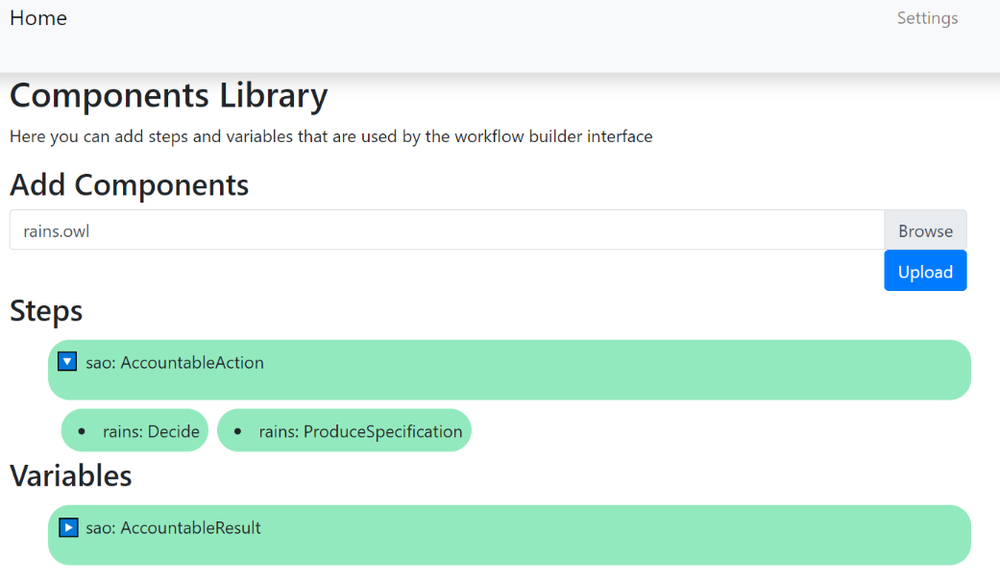
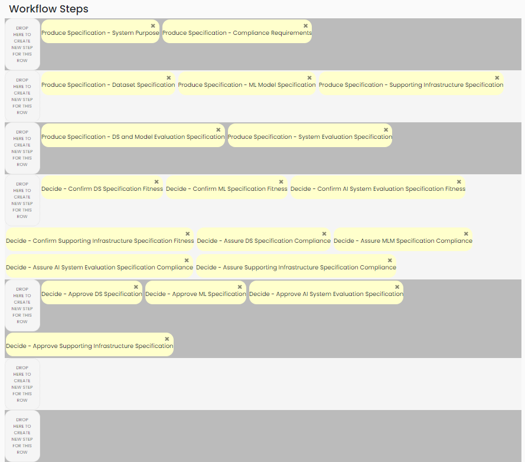

# Example Knowledge Graph
This readme is composed of two sections. The first section describes the scenario we used to create the knowledge graph. The second section consists of documentaion describing how the Accountability Fabric can be used. If you only want documentation on how to use the tool, without the benefit of the example scenario, jump to **Section II**.

## Section I: Scenario: 
The knowledge graph was created based on a fictional scenario, drawn up from our competency questions that were extracted from existing literature as well as experience from our conferences with our NHS partners.
Assume that a hospital wants to replace one of its two human radiologists with an AI System which can read mammography images and detect breast cancer. 
We present an accoountability design plan and an accountability trace asspociated with the plan. While the accountability design plan is generic and not specifically related to the medical domain, the accountability trace is an example of how those involved may produce accountability information at the design stage of an AI System, the purpose of which is to detect breast cancer. 
Note: This is a fictional scenario, the presented design choices saved as accountability traces are **not the optimal ones**, some inferior choices were deliberately made to illustrate that the design stage plays a crucial role in the preventing failures of AI Systems. Some choices were also deliberately not made to show how not following recommended accountability measures may also result in pitfalls down the line because of the absence of this information. 
#### The Accountability Design Plan
##### First, we have the following two steps:
1.	Produce Specification: System Purpose. 
    1.	Input: /
    2.	Output: System Purpose Specification _(vdp_I_sp)_. 
    3. Description: Aim to answer the following questions
        1. What is the intended objective of the AI System, i.e. what are the tasks that the AI System is performing.
        2. Who are the intended users of the AI System.
2.	Produce Specification: Compliance Requirements
    1.	Input: /
    2.	Output: Compliance Specification _(vdp_I_cr)_. 
    3. Description: Aim to answer the following questions
        1. What are the hard laws that the AI System must follow.
        2. What are the soft laws that the AI System must follow.
##### Second, we have the following three steps:
1.	Produce Specification: Dataset Specification
    1.	Input: 
        1. System Purpose Specification _(vdp_I_sp)_
        2. Compliance Specification _(vdp_I_cr)_
    2. Output: Dataset Specification _(vdp_II_dss)_. 
    3. Description: Aim to answer the following questions
        1. What is the purpose of the dataset.
        2. What are the tasks for which the dataset is not to be used for.
        3. What are the limitations associated with the dataset.
        4. What are the risks (including bias) associated with the dataset.
        5. What is the method of data collection associated with the dataset. This includes who is involved, over what timeframe the data collection process is, how it is collected, and what are the mechanisms and procedures used.
        6. What is the dataset pre-processing mechanism, including sampling.
        7. What are the characteristics associated with the dataset. This includes how many instances make up the dataset, what do the instances represent, what are the types of instances, do the instances have associated labels or targets, what are the errors, noises, redundancies in the dataset, is there any information missing from instances, are relationships between instances explicit.
        8. What are the hard and soft laws that the dataset conforms with.
        9. If dataset is 3rd party 
            1. Who created the dataset and what is their contact information.
            2. What funding was associated with the dataset.
            3. What license was associated with the dataset.
2.	Produce Specification: ML Model Specification
    1.	Input: 
        1. System Purpose Specification _(vdp_I_sp)_ 
        2. Compliance Specification _(vdp_I_cr_)
    2.	Output: Model Specification _(vdp_II_mlms)_
    3.	Description: Aim to answer the following questions
        1. What is the purpose of the model.
        2. What are the tasks for which the model is not to be used for.
        3. What are the limitations associated with the model.
        4. What are the risks (including bias) associated with the use of the model, within this system context.
        5. What are the characteristics of the model. This includes the type of model, the algorithm, decision thresholds and basis of prioritisation – and how those were chosen, programming method. 
        6. What are the hard and soft laws the model intends to conform with.
        7. If model is 3rd party, then
            1. Who created the model and what is their contact information.
            2. What were the licenses associated with the model.
            3. When was the model developed.
            4. What parameters were used when creating the model.
            5. What was the funding associated with the model.
3.	Produce Specification: Supporting Infrastructure Specification
    1.	Input: 
        1.	System Purpose Specification _(vdp_I_sp)_
        2.	Compliance Specification _(vdp_I_cr)_
    2.	Output:  Supporting Infrastructure Specification _(vdp_II_sis)_
    3.	Description: Aim to answer the following questions
        1. How was the human oversight designed to be implemented by the AI system.
        2. What were the audit mechanisms described.
        3. What level of explanations could be provided by the system.
        4. What will the hard and soft laws the supporting infrastructure intends to conform with.
##### Third, we have the following two steps:
1.	Produce Specification: DS and Model Evaluation Specification
    1.	Input: 
        1. System Purpose Specification _(vdp_I_sp)_
        2. Compliance Specification _(vdp_I_cr)_
        3. Dataset Specification _(vdp_II_dss)_
        4. Model Specification _(vdp_II_mlms)_
    2.	Output: Evaluation Specification - DS and Model _(vdp_III_dsmlmevs)_
    3.	Description: Aim to answer the following questions
        1. What is the dataset used for evaluation. If not a subset of the training dataset, then what is the pre-processing method associated with the evaluation dataset.
        2. What was are the evaluation specification. This includes evaluation factors. 
        3. What are the evaluation measure values. Either expected/required or if model is 3rd party then how did the model perform with respect to each evaluation factor.
        4. What were - or will be - the hard and soft laws was the evaluation intends to conform with.
1.	Produce Specification: System Evaluation Specification
    1.	Input: 
        1. System Purpose Specification _(vdp_I_sp)_
        2. Compliance Specification _(vdp_I_cr)_
        3. Supporting Infrastructure Specification _(vdp_II_sis)_
        4. Dataset Specification _(vdp_II_dss)_
        5. Model Specification _(vdp_II_mlms)_
    1.	Output: Evaluation Specification - Whole System  _(vdp_III_sevs)_
    1.	Description: Aim to answer the following questions
        1. How is the system evaluated as a whole. Does the system fail in certain settings.
        2. What are the limitations associated with the system as a whole.
        3. What are the risks (including bias) associated with the use of the AI System, directly or indirectly.
##### Fourth, we have the following eight steps:
1.	Decide: Confirm DS Specification Fitness
    1.	Input: 
        1. System Purpose Specification _(vdp_I_sp)_
        2. Dataset Specification _(vdp_II_dss)_
    1.	Output: Fitness Confirmation Decision - DS Specification _(vdp_IV_cdsf)_
    1.	Description: Confirm the fitness of the dataset specification to task
1.	Decide: Confirm ML Specification Fitness
    1.	Input: 
        1. System Purpose Specification _(vdp_I_sp)_
        2. Model Specification _(vdp_II_mlms)_
    1.	Output: Fitness Confirmation Decision - MLM Specification _(vdp_IV_cmlmsf)_
    1.	Description: Confirm the fitness of the MLM specification to task
1.	Decide: Confirm AI System Evaluation Specification Fitness
    1.	Input: 
        1. System Purpose Specification _(vdp_I_sp)_
        2. Evaluation Specification - DS and Model _(vdp_III_dsmlmevs)_
        3. Evaluation Specification - Whole System _(vdp_III_sevs)_
    1.	Output: Fitness Confirmation Decision - AI System Evaluation Specification _(vdp_IV_ceaisvsf)_
    1.	Description: Confirm the fitness of the evaluation specification to task
1.	Decide: Confirm Supporting Infrastructure Specification Fitness 
    1.	Input: 
        1. System Purpose Specification _(vdp_I_sp)_ 
        2. Supporting Infrastructure Specification _(vdp_II_sis)_
    1.	Output: Fitness Confirmation Decision - SI Specification _(vdp_IV_csisf)_
    1.	Description: Confirm the fitness of the supporting infrastructure specification to task
1.	Decide: Assure DS Specification Compliance
    1.	Input: 
        1. Compliance Specification _(vdp_I_cr)_
        2. Dataset Specification _(vdp_II_dss)_
    1.	Output: Compliance Assurance Decision - DS Specification _(vdp_IV_cadss)_
    1.	Description: Assurance the compliance of the dataset specification to hard and soft laws
1.	Decide: Assure ML Specification Compliance
    1.	Input: 
        1. Compliance Specification _(vdp_I_cr)_
        2. Model Specification _(vdp_II_mlms)_
    1.	Output: Compliance Assurance Decision - MLM Specification _(vdp_IV_camlms)_
    1.	Description: Assurance the compliance of the MLM specification to hard and soft laws
1.	Decide: Assure AI System Evaluation Specification Compliance
    1.	Input:
        1. Compliance Specification _(vdp_I_cr)_
        2. Evaluation Specification - DS and Model _(vdp_III_dsmlmevs)_
        3. Evaluation Specification - Whole System _(vdp_III_sevs)_
    1.	Output: Compliance Assurance Decision - AI System Evaluation Specification _(vdp_IV_caaisevs)_
    1.	Description: Assurance the compliance of the AI system evaluation specification to hard and soft laws
1.	Decide: Assure Supporting Infrastructure Specification Compliance
    1.	Input:
        1. Compliance Specification _(vdp_I_cr)_
        2. Supporting Infrastructure Specification _(vdp_II_sis)_
    1.	Output: Compliance Assurance Decision - SI Specification _(vdp_IV_casis)_
    1.	Description: Assurance the compliance of the suporting infrastructure specification to hard and soft laws
##### Fifth and finally, we have the following four steps:
1.	Decide: Approve DS Specification
    1.	Input: 
        1. Dataset Specification _(vdp_II_dss)_
        2. Fitness Confirmation Decision - DS Specification _(vdp_IV_cdsf)_ 
        3. Compliance Assurance Decision - DS Specification _(vdp_IV_cadss)_
    1.	Output: Approval Decision - DS Specification _(vdp_V_appdss)_
    1.	Description: Approve the dataset specification
1.	Decide: Approve ML Specification
    1.	Input:
        1. Model Specification _(vdp_II_mlms)_
        2. Fitness Confirmation Decision - MLM Specification _(vdp_IV_cmlmsf)_
        3. Compliance Assurance Decision - MLM Specification_(vdp_IV_camlms)_
    1.	Output: Approval Decision - MLM Specification _(vdp_V_appmlms)_
    1.	Description: Approve the MLM specification
1.	Decide: Approve AI System Evaluation Specification
    1.	Input: 
        1. Evaluation Specification - DS and Model _(vdp_III_dsmlmevs)_
        2. Evaluation Specification - Whole System _(vdp_III_aisevs)_ 
        3. Fitness Confirmation Decision - AI System Evaluation _(vdp_IV_cevsf)_
        4. Compliance Assurance Decision - AI System Evaluation _(vdp_IV_caevs)_
    1.	Output: Approval Decision - AI System Evaluation Specification _(vdp_V_appaisevs)_
    1.	Description: Approve the AI system evaluation specification
1.	Decide: Approve Supporting Infrastructure Specification
    1.	Input: 
        1. Supporting Infrastructure Specification _(vdp_II_sis)_
        2. Fitness Confirmation Decision - SI Specification _(vdp_IV_csisf)_ 
        3. Compliance Assurance Decision - SI Specification _(vdp_IV_casis)_
    1.	Output: Approval Decision - SI Specification _(vdp_V_appsis)_
    1.	Description: Approve the supporting infrastructure specification

#### The Collected Provenance
If you are familiar with SAO and RAInS: note that the words in bold refer to the created instances of the RAInS' subclasses of SAO's Information Element.
##### System-level Design 
1.	Indicate the purpose of the system: 
    1. **Intended Use Case**: _breast cancer detection, classifying mammography images of women between the ages of fifty and seventy_.
    2. **Intended User Group**: _radiologists_.
2.	Indicate compliance specifications:
    1. **Hard Law**: _complying with the EU's Class IIb Medical Devices Directive and GDPR_;
    2. **Soft Law**: _complying with the following standards: ISO 13485, ISO 14971:2019, and NHS Code of conduct for data-driven health and care technology_.
##### Dataset Design
Produce a dataset design by either designing a dataset or choosing an off-the-shelf one: _Use the 3rd party dataset CBIS-DDSM (https://wiki.cancerimagingarchive.net/display/Public/CBIS-DDSM). This is what is known about this dataset_: 
1.	Its creator (**Accountable Agent**): _R. Lee and the authors of this paper: https://www.nature.com/articles/sdata2017177_.
2.	Its **Dataset Characteristics**: _2,620 studies in the form of films (DICOM images) covering malignant, benign, and normal diagnoses. It was originally produced as part of the DDSM_.
3.	Its **Funding**: _none, but the DDSM was funded by DOD Breast Cancer Research Program and US Army Research and Material Command_.
4.	Its **Data Collection Procedure**: _collected from four American hospitals with patient consent (Massachusetts General Hospital, Wake Forest University School of Medicine, Sacred Heart Hospital, and Washington University of St Louis School of Medicine)_.
5.	Its **Data Preprocessing Procedure**: _raw pixel data was converted into 64-bit optical density values, which were in turn re-mapped to 16-bit grey scale TIFF files and finally converted to DICOM format. A noise reduction function was applied to the DICOM format. Images were cropped and a lesion segmentation algorithm was applied. Images were split 80% marked for training and 20% marked for testing with very close percentage of case numbers in each_. 
6.	Its **Intended Use Case**: _CAD (Computer-Aided Detection and Diagnosis) research in mammography_. 
7.	**Limitation**: _scanned film instead of full field digital mammograms_.
8.	Its **Risk**: _the DDSM was released in 1997, only 2,620 studies_.
9.	Its **LicenseDocument**: _this is left blank_
10.	Indicate compliance specifications: 
    1. **Hard Law**: _complying with GDPR_.
    2. **Soft Law**: _complying with NHS Code of conduct_. 
11. We did not indicate this dataset's **Bias** or **Incorrrect Use Case**.
##### Model Design
Produce a model design by either designing a model or choosing an off-the-shelf one: _design a Deep learning (DL) breast cancer image analysis model, below are the information about the model_:
1. Its **Intended Use Case**: _computer aided breast cancer image analysis_.
2. Its **Model**: _Neural Network model, minimum 7 layers_
3. Its **Algorithm**: _Convolutional Neural Netowrk_
4. Its **ModelCharacteristic**: _the model should classify images as: normal, benign mass, benign microcalcification, malignant mass, malignant microcalcification. Max pooling should be applied. Implementation plans:  programming language: Python and development environment Anaconda_
5. Its **Limitation**: _it is not possible to perform feature selection or to fine-tune hyperparameters_ 
6. Its **Risk**: _DL NN perform better with larger amounts of images than they do on smaller amounts (overfitting problem which can be mitigated by applying augmentation techniques)_
7. Indicate compliance specifications: 
    1. **Hard Law**: _complying with the EU's Class IIb Medical Devices Directive_.
    2. **Soft Law**: _complying with the following standards: ISO 13485, ISO 14971:2019, and NHS Code of conduct_.  
8. We did not indicate this model's **Bias** or its **Incorrrect Use Case**.
##### Supporting Infrastructure Design:   
Produce a supporting infrastructure design with the following information: _descriptions of the components that the system must be integrated with: The electronic health system Scottish Breast Screening System (SBSS) which contains the patient files, and with the Picture archiving and communication system (PACS) which stores the mammography images and is already integrated with SBSS. The designs of the components which are not core-AI: API wrappers for reports_. 
1. **System Audit Mechanism**: _The following will be audited: recall rates, positive predictive values, cancers missed through disagreements, and interval cancers (cancers detected between screening rounds, presenting symptomatically)_
2.	**System Explanation Mechanism**: _the region of interest (ROI) is to be annotated with has been diagnosed including the mass, microcalcification, architectural distortion, and bilateral asymmetry_.
3.	**System Human Agency and Oversight Mechanism**: _one human reader will make a diagnosis and the AI System will make its diagnosis. If there is a disagreement, then a second human reader will access both diagnoses and the images and make their own diagnosis which is final_.
4. Supporting Infrastructure **Limitation**: _if PACS doesn’t produce DICOM with same picture quality then the ML model performance won’t be good_. 
5. We did not indicate compliance specifications, i.e. **Hard Law**, **Soft Law**, **Risk**, **Bias**, for the supporting infrastructure.
##### DS and MLM Evaluation Design
Produce an evaluation design for the dataset and ML model: _use the same dataset used for training for the evaluation_
1.	**Evaluation Procedure**: _the proposed evaluation technique is 5-fold Cross Validation (CV)_
2.	**Evaluation Measure**: _90% of the cancers must be detected_
3.	We did not indicate compliance specifications, i.e. **Hard Law**, **Soft Law**, **Risk**, **Bias**, or **Limitation**.
##### Whole System Evaluation Design
Produce an evaluation design for the whole system:
1.	**Evaluation Procedure**: _check the model with minimum sample DICOM images from PACS currently in use_
2.	**Evaluation Measure**: _all sample DICOM images from currently deployed PACS must be successfully input to the system_
3.	We did not indicate compliance specifications, i.e. **Hard Law**, **Soft Law**, **Risk**, **Bias**, or **Limitation**.

##  Section II: Guide to using the tool

### I. Initial Setup and running: 
#### A. Please read the initial setup instructions here: https://github.com/RAINS-UOA/rains-workflow-builder/blob/ESWC-2020/README.md
#### B. Run the project as ‘Spring Boot App’. By default, you can access the Accountability Framework from a browser on http://localhost:8080/. 
#### C. If you do not want to follow the instructions below, and just want access to the example knowledge graph which was created
Download the trig file from here: https://github.com/RAINS-UOA/ESWC_2021_Evaluation/blob/main/exampleKnowledgeGraph/AccountabilityFabricRepo.trig, 
then import it into the AccountabilityRepository on GraphDB. 
Otherwise, you can proceed with the below instructions.
#### D. Click on ‘Workflow Components Library’

#### E. On this page: 
1.	Browse to the file containing the ontologies.
 
2.	Upload SAO. Then also upload RAInS. 
3.	The components are now imported and can used – you do not need to do anything else:
 

### II. Creating your AI System:
#### A. Click on ‘Systems Library’
 
#### B. Click on ‘Add New System URI’
 
#### C. On this page:
1.	Fill in the name of your system in the Label text field (this is a text label, it is not your system’s IRI; the IRI will be automatically created)
2.	Fill in the Description (optional)
3.	Click ‘Submit’
 
#### D. The system is now created in the graph store – you do not need to do anything. The ID of the system is clickable and will take you to a new page so you can start populating the fields.
 

### III. Creating the Plan:
#### A. Click on ‘Systems Library’
  
#### B. Click on the name of the system you want to start with:
   
#### C. On this page:
1.	Section (1) displays the unchangeable details of your system: the IRI which was automatically created, the label, and the description.
2.	Section (2) displays the hierarchy of the system’s accountable objects. You can create Accountable Objects here (For more details ono this, see VIII.A).
3.	Section (3) displays the system’s life cycle (only the Design stage in this version). This is where you can create plans. Note that once you’ve created a plan, the ‘Create Plan’ button will be replaced with a ‘Generate Provenance Collection Interface’ button.
4.	Section (4) displays a button which opens the audit manager in a new tab. At this stage there are no saved provenance records, so the audit manager tab will only display empty results.
  
#### D. First, create your accountable objects by expanding the list and creating on ‘Add Object’
  
#### E. Enter the details of the accountable objects:
   
#### F. The accountable object you created now shows under your system’s name:
   
#### G. Once you’ve created all the accountable object you want, you can proceed to click on ‘Create Plan’:
   
#### H. On this page:
1.	Section (1) is where you input the plan’s label and descriptions as plain text.
2.	Section (2) is where the plan’s steps are created. Steps are dragged from Section (2a) onto Section (2b). Additional elements such as variables are created in Section (3b).
3.	Section (3) is where the plan can be saved and where additional templates can be imported.
  
#### I. Start with dragging a step from the Steps Library (2a) onto one row of the Workflow Steps (2b):
   
#### J. Click on the step to change its label:
   
#### K. Fill in the description of the step in Inspect Element (2c):
   
#### L. Click on the plus sign next to Inputs or next to Outputs in Inspect Element (2c):
   
#### M. In the popup, click on ‘Create New Variable’:
   
#### N. Fill in the values and click on ‘Add’:
  
#### O. The variable is now created. Click ‘Add Selected Variables’ to add it.
#### P. The variable now appears. Click on ‘Apply Changes’ to save the changes for this step:
   
#### Q. Once you’ve finished creating all the steps, your workflow steps will look something like this:
   
#### R. Click on ‘Save’ in Section (3) to save your plan.
   

### IV. Creating the Provenance Records:
#### A. Back on the System’s page, the ‘Create Plan’ button has now been replaced with a ‘Generate Provenance Collection Interface’ button. Click on it:
  
#### B. A new tab opens which displays the Provenance Collector. Fill in the Information in the top section then click on ‘Generate Provenance Collection Tasks’
 
#### C. A task to collect provenance is now created, click on ‘click to complete task’ 
 
#### D. A new tab opens where you can start populating the fields:
 
#### E. Example: Produce System Purpose Specification (this step does not have any inputs from previous steps)
1.	Fill in the Start and End dates of the task
2.	Fill in who performed the task – this has to be an IRI of a person
3.	Fill in the description of the outputs
4.	Click on ‘Add Information Element’ to add information elements, you will get a popup. Choose the type of the information element from the drop-down list. In this example, we will choose ‘Intended Use Case’.
5.	Click on ‘Add Information Element’ to add information elements, you will get a popup. Choose the type of the information element from the drop-down list. In this example, we will choose ‘Intended Use Case’
 
6.	Fill in the other information of this information element and Click ‘Add Element’.
7.	This step will look like the below.:
 
#### F. If a step has inputs from previous steps, they will be listed in the Inputs Section:

#### G. Once you’ve finished, click submit. You will get a confirmation message:
 

### V. Using the Audit Manager:
#### A. Back on the System’s page, click on ‘Open Audit Manager’.
#### B. A new tab opens. Section 1 shows the accountable agents. The IRIs of the accountable agents are clickable. When one is clicked, Section 2 shows the accountable actions that were associated with that agent, along with the results produced by said action (clicking on any of these show their details in the box in Section 3), and what other actions depend on this action (clicking on any of these show their details in the box in Section 3), and how the accountable result relates to an accountable object.
 
#### C. Click on an agent, for example jane.smith. The Results tab of Section (2) now lists this agent’s accountable actions
  
#### D. Clicking on accountable result makes Section 3 display its information elements:
1.	
  
2.	
  
#### E. Clicking on an accountable action which depends on the current one displays its information elements:
  
