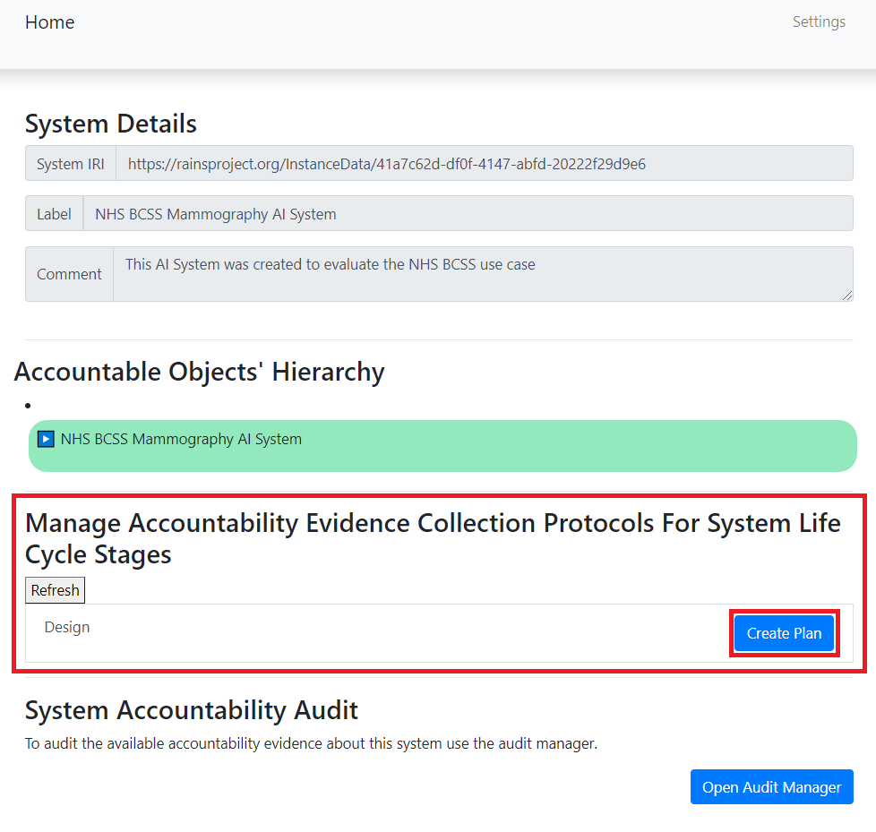
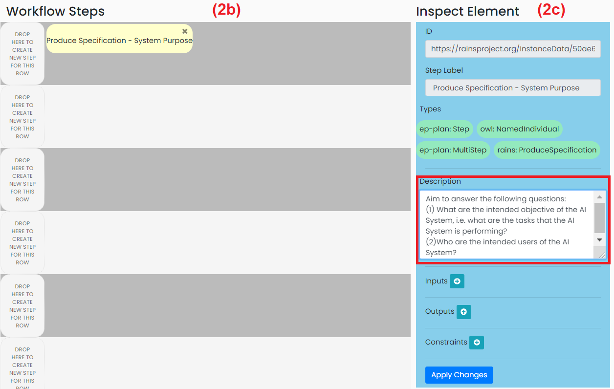
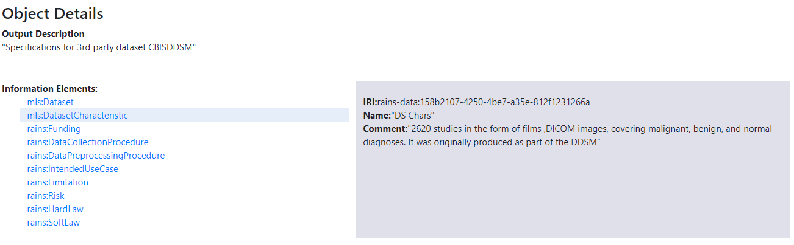

# Example Knowledge Graph

## Guide to using the tool

### I. Initial Setup and running: 
#### A. Please read the initial setup instructions here: https://github.com/RAINS-UOA/rains-workflow-builder/blob/ESWC-2020/README.md
#### B. Run the project as ‘Spring Boot App’. By default, you can access the Accountability Framework from a browser on http://localhost:8080/. 
#### C. If you do not want to follow the instructions below, and just want access to the example knowledge graph which was created
Download the trig file from here: https://github.com/RAINS-UOA/ESWC_2021_Evaluation/blob/main/exampleKnowledgeGraph/AccountabilityFabricRepo.trig, 
then import it into the AccountabilityRepository on GraphDB. 
Otherwise, you can proceed with the below instructions.
#### D. Click on ‘Workflow Components Library’
 
#### E. On this page: 
1.	Browse to the file containing the ontologies.
 
2.	Upload SAO. Then also upload RAInS. 
3.	The components are now imported and can used – you do not need to do anything else:
 

### II. Creating your AI System:
#### A. Click on ‘Systems Library’
 
#### B. Click on ‘Add New System URI’
 
#### C. On this page:
1.	Fill in the name of your system in the Label text field (this is a text label, it is not your system’s IRI; the IRI will be automatically created)
2.	Fill in the Description (optional)
3.	Click ‘Submit’
 
#### D. The system is now created in the graph store – you do not need to do anything. The ID of the system is clickable and will take you to a new page so you can start populating the fields.
 

### III. Creating the Plan:
#### A. Click on ‘Systems Library’
  
#### B. Click on the name of the system you want to start with:
   
#### C. On this page:
1.	Section (1) displays the unchangeable details of your system: the IRI which was automatically created, the label, and the description.
2.	Section (2) displays the hierarchy of the system’s accountable objects. You can create Accountable Objects here (For more details ono this, see VIII.A).
3.	Section (3) displays the system’s life cycle (only the Design stage in this version). This is where you can create plans. Note that once you’ve created a plan, the ‘Create Plan’ button will be replaced with a ‘Generate Provenance Collection Interface’ button.
4.	Section (4) displays a button which opens the audit manager in a new tab. At this stage there are no saved provenance records, so the audit manager tab will only display empty results.
  
#### D. First, create your accountable objects by expanding the list and creating on ‘Add Object’
  
#### E. Enter the details of the accountable objects:
   
#### F. The accountable object you created now shows under your system’s name:
   
#### G. Once you’ve created all the accountable object you want, you can proceed to click on ‘Create Plan’:
   
#### H. On this page:
1.	Section (1) is where you input the plan’s label and descriptions as plain text.
2.	Section (2) is where the plan’s steps are created. Steps are dragged from Section (2a) onto Section (2b). Additional elements such as variables are created in Section (3b).
3.	Section (3) is where the plan can be saved and where additional templates can be imported.
  
#### I. Start with dragging a step from the Steps Library (2a) onto one row of the Workflow Steps (2b):
   
#### J. Click on the step to change its label:
   
#### K. Fill in the description of the step in Inspect Element (2c):
   
#### L. Click on the plus sign next to Inputs or next to Outputs in Inspect Element (2c):
   
#### M. In the popup, click on ‘Create New Variable’:
   
#### N. Fill in the values and click on ‘Add’:
  
#### O. The variable is now created. Click ‘Add Selected Variables’ to add it:
   
#### P. The variable now appears. Click on ‘Apply Changes’ to save the changes for this step:
   
#### Q. Once you’ve finished creating all the steps, your workflow steps will look something like this:
   
#### R. Click on ‘Save’ in Section (3) to save your plan.
   

### IV. Creating the Provenance Records:
#### A. Back on the System’s page, the ‘Create Plan’ button has now been replaced with a ‘Generate Provenance Collection Interface’ button. Click on it:
  
#### B. A new tab opens which displays the Provenance Collector. Fill in the Information in the top section then click on ‘Generate Provenance Collection Tasks’
 
#### C. A task to collect provenance is now created, click on ‘click to complete task’ 
 
#### D. A new tab opens where you can start populating the fields:
 
#### E. Example: Produce System Purpose Specification (this step does not have any inputs from previous steps)
1.	Fill in the Start and End dates of the task
2.	Fill in who performed the task – this has to be an IRI of a person
3.	Fill in the description of the outputs
4.	Click on ‘Add Information Element’ to add information elements, you will get a popup. Choose the type of the information element from the drop-down list. In this example, we will choose ‘Intended Use Case’.
5.	Click on ‘Add Information Element’ to add information elements, you will get a popup. Choose the type of the information element from the drop-down list. In this example, we will choose ‘Intended Use Case’
 
6.	Fill in the other information of this information element and Click ‘Add Element’.
7.	This step will look like the below.:
 
#### F. If a step has inputs from previous steps, it will look like this (the red rectangle highlights the inputs):

#### G. Once you’ve finished, click submit. You will get a confirmation message:
 

### V. Using the Audit Manager:
#### A. Back on the System’s page, click on ‘Open Audit Manager’.
#### B. A new tab opens. Section 1 shows the accountable agents. The IRIs of the accountable agents are clickable. When one is clicked, Section 2 shows the accountable actions that were associated with that agent, along with the results produced by said action (clicking on any of these show their details in the box in Section 3), and what other actions depend on this action (clicking on any of these show their details in the box in Section 3), and how the accountable result relates to an accountable object.
 
#### C. Click on an agent, for example jane.smith. The Results tab of Section (2) now lists this agent’s accountable actions
  
#### D. Clicking on accountable result makes Section 3 display its information elements:
1.	
  
2.	
  
#### E. Clicking on an accountable action which depends on the current one its information elements:
  

